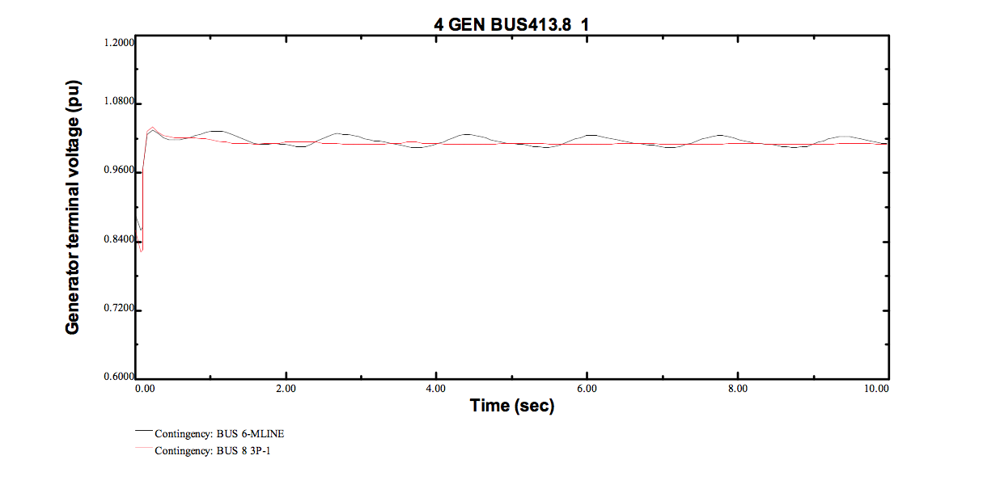
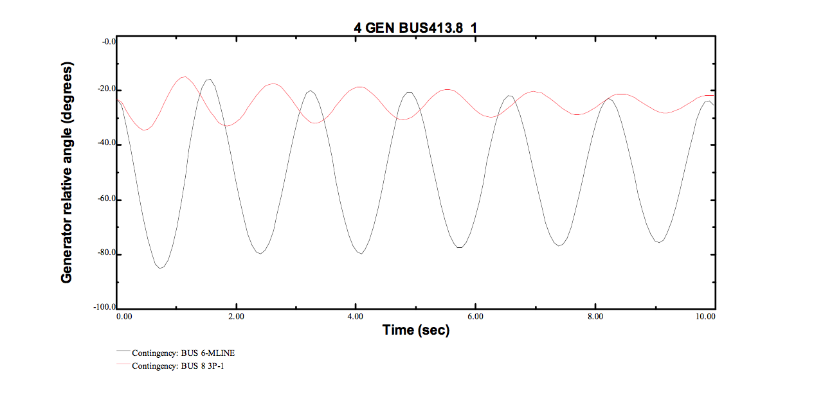

# TSAT-VBScripts

## Description

Batch plot response for various variables including active and reactive power outputs, bus voltages of the Generating units, bus voltages for substations near the connection point. 

## Plot example

